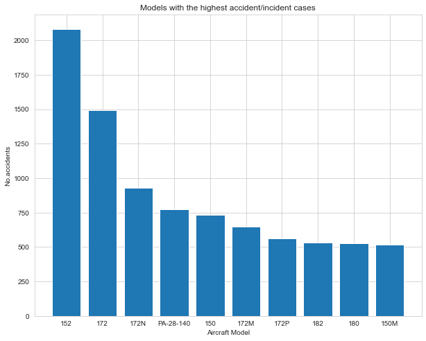
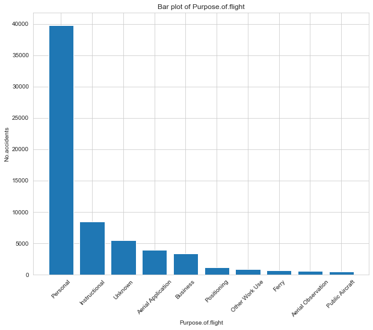

AVIATION ANALYSIS

Overview
It's important for a business to know how to fly both commercial and private aircraft as it grows into the aviation sector. However, it's crucial to comprehend the safety dangers connected to various aircraft models before making any purchases. In order to help the organization make data-driven decisions that reduce risk and improve operational safety, my job in this project is to analyze historical aviation accident data and identify the safest aircraft.

Objective

By evaluating the safety performance of different aircraft models and utilizing historical data from the National Transportation Safety Board (NTSB) aviation accident database, this aviation safety study seeks to inform a company's aircraft purchase decisions. The investigation will explore critical factors influencing aircraft safety, with an emphasis on risk minimization and operational safety enhancement for both commercial and private aviation

Business Understanding

1.Safety First: We are in line with the company's emphasis on safety and risk management by selecting the safest aircraft models, which lowers the possibility of such events.

2.Operational and Environmental Factors: In variable weather conditions and throughout crucial flight stages (such as takeoff and landing), aircraft must operate safely. To ensure constant safety, we want models that can adapt to a variety of operational demands and conditions.

3.Specific Suggestions: Aircraft selection is contingent upon the nature of the intended use, be it educational, business, or personal travel. Our research will assist in determining which models are most appropriate for our particular operating requirements, enabling us to select aircraft that operate effectively in both private and commercial settings.

Data Understanding and Analysis

Source of Data:

The data used is from the National Transportation Safety Board was understood in order to explore and familiarize ourselves with the dataset, ensuring it meets the requirements for analysis.

Description of the data
The dataset has 90348 records and 31 columns and covers a time period from 1942-2022 and it covers varios aspects of aviation accidents, including:

Categorical variables:

  Aircraft models (e.g., Cessna, Piper, Beechcraft)
  Flight phases (e.g., landing, takeoff, cruise)
  Weather conditions (VMC, IMC)
  Purpose of flight (e.g., personal, instructional, business)
  Accident severity (e.g., fatal, non-fatal)
  Aircraft damage (e.g., minor, major, destroyed)
  Investigation type (accident vs. incident)
Numerical variable:

  Number of Engines: The engine configuration of the aircraft, which can impact safety.
  Injury Data: Variables including Total Fatal Injuries, Total Serious Injuries, Total Minor Injuries, and Total Uninjured passengers.

Data Analysis

According to available data, the Cessna 152 has had the greatest number of incident investigations (2,083), with the Cessna 172 and the Cessna 172N having the next-highest numbers of incidents (1,494 and 930, respectively). Citing pipeline models like PA-28-140 (775 instances) and PA-28-150 (731 cases) is also popular. This suggests that some aircraft, especially popular training models like the Cessna 152 and 172, are often linked to accidents, most likely because to their widespread use in flight schools and private aviation.

The data shows that personal flights have the most accidents, with 39,762 incidents. This could be because private pilots have different levels of experience and may not follow strict maintenance rules. 

Instructional flights, where students are learning to fly, also have a high number of incidents, with 8,486 reported. This is likely because students are still developing their skills.

Other types of flights, like crop-dusting (3,987 incidents) and business flights (3,337 incidents), also have some risk. These incidents may be due to the unique challenges of each type of flight, such as farming tasks or frequent travel for business.

It's important to consider how different aircraft models perform in various weather conditions, as weather plays a big role in flight safety. In this analysis, we will focus on the impact of weather. We have three categories of weather conditions:

- **VMC (Visible Meteorological Conditions)** 
- **IMC (Instrument Meteorological Conditions)** 
 - **Unknown** 
By comparing how different aircraft handle these weather conditions, we can see which models perform better in certain situations. This will help us make informed decisions about which aircraft are safest and most suitable for different flying environments.

Conclusion and Recommendations

To sum up, putting safety first in aviation operations—especially for recreational and educational flights—needs a multipronged strategy that examines popular aircraft types and makes sure they are maintained properly and have cutting-edge safety features. To improve situational awareness and lessen dependence on visual signals, extensive pilot training should be implemented, particularly for aircraft such as the PA-28-181, 172N, and A36, especially when it comes to instrument flight. Furthermore, the risks associated with varying pilot experience levels and climatic conditions can be considerably reduced by choosing aircraft with a high safety record and implementing rigorous maintenance schedules. By taking these steps, we can make flying safer for pilots and passengers alike.

References
-For more on Tableau visualization:[https://public.tableau.com/views/Book1_17273079982300/Dashboard14?:language=en-US&publish=yes&:sid=&:redirect=auth&:display_count=n&:origin=viz_share_link]

-To get the slides presentation: [https://docs.google.com/presentation/d/1tzChm6asdcUkMZ7_TCyq6zkZJObhroE5__p7wPdIsDQ/edit?usp=sharing]

